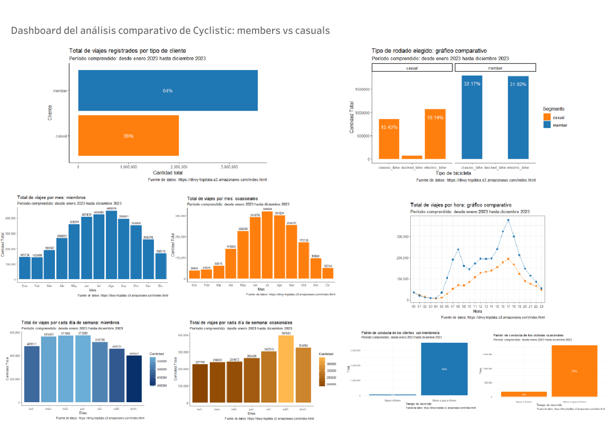

# Análisis de Diferencias entre Clientes Ocasionales y Clientes con Membresía Anual de Cyclistic

## Introducción
Este proyecto fue realizado como parte de la Certificación de Análisis de Datos de Google en Coursera. El objetivo principal es analizar las diferencias en el uso de las bicicletas entre los distintos segmentos de clientes de Cyclistic, una empresa ficticia de alquiler de bicicletas compartidas. Esto ayudará a diseñar una estrategia de marketing efectiva para convertir a ciclistas ocasionales en miembros anuales.

## Contexto del Proyecto

### A) Generalidades
Como analista de datos júnior en el equipo de analistas de marketing de Cyclistic, tu tarea es comprender las diferencias en el uso de las bicicletas entre ciclistas ocasionales y miembros anuales. La directora de marketing, Lily Moreno, cree que maximizar el número de membresías anuales es crucial para el futuro éxito de la empresa. Para respaldar tus recomendaciones, debes proporcionar una visión convincente de los datos acompañada de visualizaciones profesionales.

### B) Equipos y Personajes
**Cyclistic:** Programa de bicicletas compartidas con más de 5,800 bicicletas y 600 estaciones en Chicago.

**Lily Moreno:** Directora de marketing de Cyclistic.

**Equipo de Análisis Computacional de Datos de Marketing de Cyclistic:** Encargados de recopilar y analizar datos para la estrategia de marketing.

**Equipo Ejecutivo de Cyclistic:** Aprobación del programa de marketing recomendado.

### C) Sobre la Empresa
Desde su lanzamiento en 2016, Cyclistic ha crecido para incluir una flota de más de 5,800 bicicletas y 690 estaciones en Chicago. Las bicicletas pueden ser desbloqueadas desde una estación y devueltas en cualquier otra estación del sistema en cualquier momento.

### D) Estrategia de Marketing Actual
La estrategia actual de Cyclistic se basa en la flexibilidad de sus planes de precios: pases de un solo viaje, pases de un día completo y membresías anuales. Los clientes ocasionales compran pases de un solo viaje o de un día completo, mientras que los miembros anuales tienen un pase para todo el año.

### E) Objetivo de Marketing
La meta es diseñar estrategias para convertir a los ciclistas ocasionales en miembros anuales, ya que los miembros son más rentables y conocen bien el programa Cyclistic.

### F) Meta
Para cumplir con esta meta, es crucial entender:

Las diferencias entre miembros anuales y ciclistas ocasionales.

Las razones por las cuales los ciclistas ocasionales comprarían una membresía.

Cómo los medios digitales podrían afectar las tácticas de marketing.

## Análisis Exploratorio de Datos (EDA)

## Incidencia en el Total

Los **clientes con membresía** realizaron el **64.09%** de los viajes.

Los **ciclistas ocasionales** realizaron el **35.91%** de los viajes.

Esto sugiere que los clientes con membresía realizan un **78.46%** más viajes que los ciclistas ocasionales.

## Conducta Reflejada en los Tiempos de Viaje

**Clientes con Membresía:** El **98.52%** de los viajes son menores o iguales a 45 minutos.

**Ciclistas Ocasionales:** El **91.30%** de los viajes son menores o iguales a 45 minutos.

Esto muestra un comportamiento similar entre ambos segmentos, lo que sugiere que es posible convertir a los ciclistas ocasionales en clientes con membresía sin que cambien significativamente sus hábitos de uso.

## Total de Viajes Mensuales

Ambos segmentos muestran estacionalidad en la demanda.

**Meses con Mayor Demanda:** Junio, Julio, y Agosto.

**Meses con Menor Demanda:** Diciembre, Enero, y Febrero.

## Total de Viajes Semanales

### Miembros

- Mayor demanda de viajes los martes, miércoles y jueves.

- Menor demanda de viajes los domingos.

### Ocasionales

- Mayor demanda de viajes los sábados y domingos.

- Menor demanda de viajes los lunes.

## Total de Viajes por Hora del Día

- Ambos segmentos tienen picos de demanda a las 17 hs.

- **Clientes con Membresía:** Pico adicional a las 08 hs, lo que sugiere uso por motivos laborales o académicos.

- **Ciclistas Ocasionales:** Incremento gradual hasta las 17 hs, lo que sugiere uso para actividades de ocio.

## Tipo de Rodado Elegido

### Miembros:

- 50.2% bicicletas clásicas.

- 49.8% bicicletas eléctricas.

### Ocasionales:

- 53% bicicletas eléctricas.

- 43% bicicletas clásicas.

- 4% bicicletas ancladas.

## Visualización

Para una presentación clara y comprensible de los datos, se ha creado un dashboard que resume toda la información obtenida. A continuación, se incluye una captura del cuadro de mando:

## Conclusiones y Recomendaciones

### Conclusiones
- La estacionalidad y los patrones de uso son factores clave para diseñar estrategias de marketing.

- Los ciclistas con membresía tienden a usar las bicicletas por motivos laborales o académicos, mientras que los ciclistas ocasionales las usan principalmente para ocio.

- La preferencia por bicicletas eléctricas entre los ciclistas ocasionales sugiere una oportunidad para promocionar este tipo de rodado.

### Recomendaciones

1- **Acceso Preferencial:** Ofrecer acceso preferencial a los miembros durante las horas pico.
2- **Planes de Membresía Flexibles:** Implementar planes de membresía mensuales o trimestrales.
3- **Asociaciones Locales:** Asociarse con negocios locales para ofrecer descuentos mutuos.
4- **Opciones Indoor:** Ofrecer opciones de ejercicio indoor para elevar la demanda en meses fríos.
5- **Campañas de Concientización:** Promover los beneficios para la salud y el medio ambiente del uso de bicicletas.
6- **Beneficios Semanales:** Ofrecer beneficios para los usuarios que utilizan las bicicletas durante la semana.

